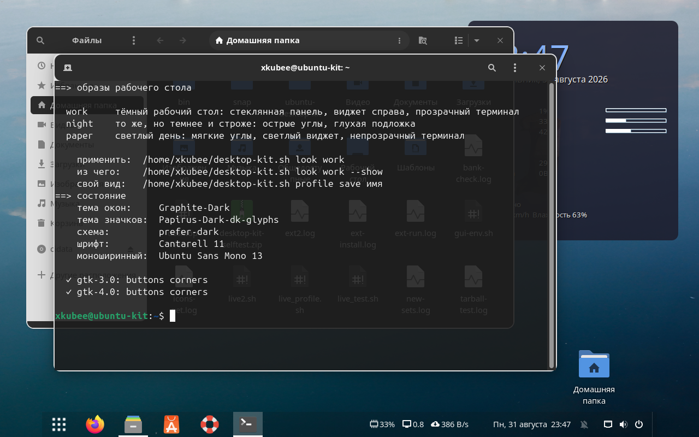
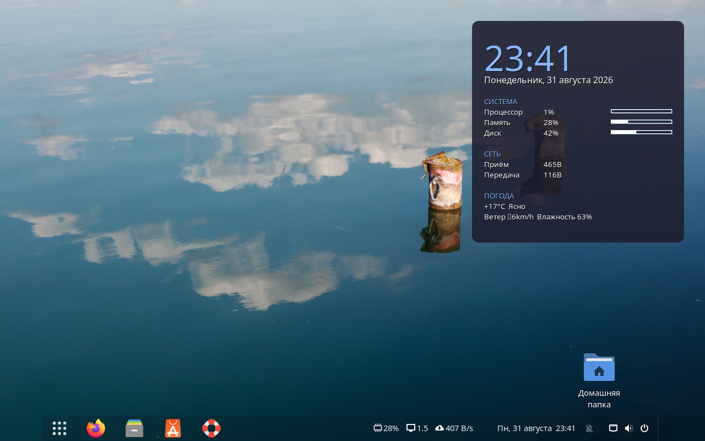
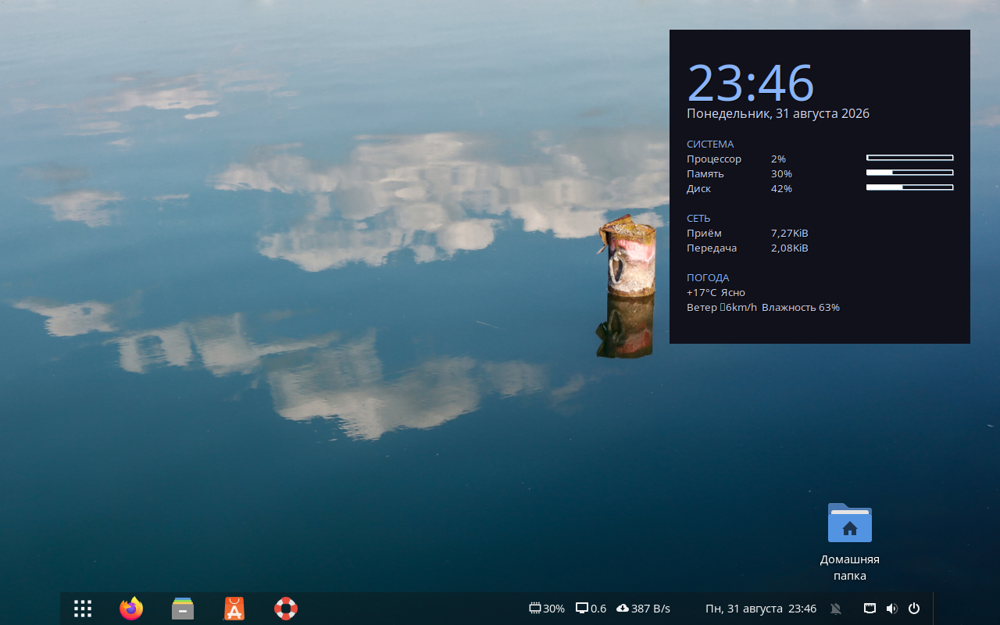
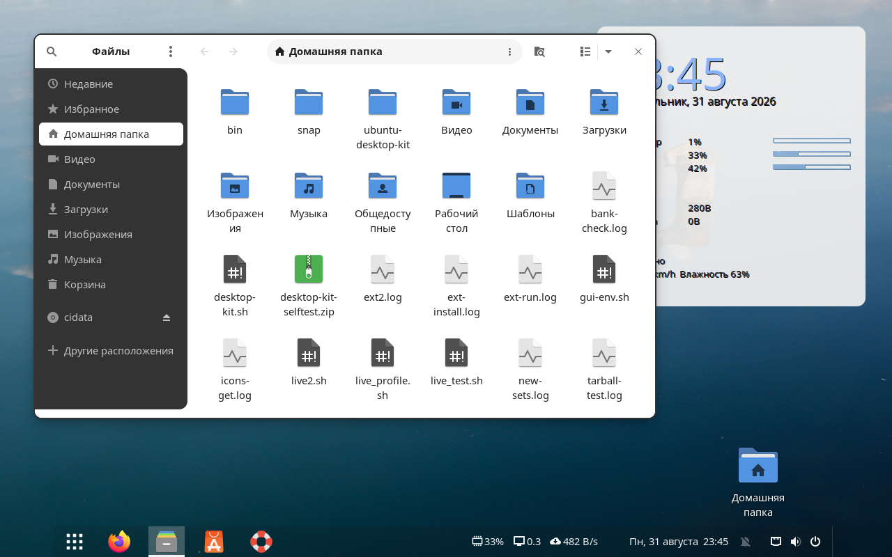

# Ubuntu Desktop Kit

Один скрипт, который собирает из свежей Ubuntu 24.04 настроенный десктоп — и умеет вернуть всё обратно.



```bash
curl -fsSL https://raw.githubusercontent.com/kubeengineering/ubuntu-desktop-kit/main/tools/install-design.sh | bash
```

```bash
design look work
```

Две команды: первая ставит запускалку, вторая собирает вид со скриншота выше — тему, значки, кнопки заголовка, стеклянную панель, виджет и прозрачный терминал. Не понравилось — `design profile load before-look` вернёт как было.

---

## Зачем это, если есть GNOME Tweaks

Настройка десктопа обычно выглядит так: десяток вкладок с советами, `gsettings set` из чужого блога, кусок CSS в `~/.config/gtk-4.0/gtk.css`, полтора часа возни — и через месяц никто не помнит, что именно поменяли и как это отменить. А после обновления темы половина перестаёт работать.

Здесь другой подход. Каждое изменение записывается блоком с маркером, исходные значения запоминаются до первой правки, а `revert` возвращает ровно то, что было — не «умолчания системы», а именно ваше прежнее состояние. Скрипт умеет объяснить, что он собирается сделать (`--dry-run`), и проверить себя на живой машине (`selftest` — 383 проверки).

Три вещи, которых обычно нет в подобных наборах:

| | |
|---|---|
| **Всё обратимо** | `revert` — к состоянию до нашего первого вмешательства. `profile save/load` — к любому моменту, который вы сами отметили. Чужие правки в `gtk.css` при откате сохраняются. |
| **Проверяет себя сам** | `selftest --full` прогоняет каждую команду в песочнице с подставными `gsettings`, `dconf` и `curl`, сверяет результат и складывает отчёт в архив. Живые настройки при этом не трогаются вообще. |
| **Не ломает чужое** | Правила кладутся блоками `/* dk:buttons-begin */`, поэтому подсистемы не затирают друг друга, а установка вендорской темы обнаруживается и чинится (`refresh`). |

---

## Образы рабочего стола

`look` собирает согласованный вид одной командой: тему, значки, кнопки, углы, панель, виджет и терминал разом.

### `work` — тёмный, стеклянная панель, виджет справа



### `night` — темнее и строже: острые углы, глухая подложка



### `paper` — светлый день



```bash
design look work --show     # из каких команд состоит
design look work            # применить
```

Обои образ не трогает — они дело вкуса и живут отдельно (`design wall`).

---

## Что умеет

| Команда | Что настраивает |
|---|---|
| `look` | весь вид разом: work, night, paper |
| `profile` | снимок оформления целиком и возврат к нему |
| `buttons` | кнопки заголовка: размер, значки, подсветка, цвет закрытия |
| `corners` | скругление углов окон, меню и подсказок |
| `theme` | тема оформления и цветовая схема, в том числе для GTK4-приложений |
| `themes` | банк из 21 темы: от Graphite до Catppuccin и Rosé Pine |
| `icons` | тема значков, цвет папок, банк из 20 наборов |
| `font` | шрифт интерфейса и моноширинный |
| `widget` | виджет conky: создание, скругление, цвет, погода |
| `terminal` | GNOME Terminal: прозрачность, шрифт, палитра pywal |
| `panel` | панель задач Dash to Panel: прозрачность, высота, плавающая |
| `newtab` | страница новой вкладки Chrome и её ярлыки |
| `wallpapers` / `wall` | банк обоев: пополнение, расписание, смена |
| `keys` | горячие клавиши |
| `serve` | отдать локальную апку по `http://localhost` |
| `app` | своя тема для одного приложения |
| `audit` / `status` | снимок системы и что сейчас применено |
| `selftest` | проверить себя на этой машине |
| `revert` | вернуть как было |

Любая команда без аргументов показывает свои параметры и ничего не меняет. Глобальные флаги: `--dry-run`, `--yes`, `--quiet`.

```bash
design help --all        # вся справка разом
design help --settings   # полный перечень изменяемых настроек
```

---

## Банки тем и значков

Стоковые Adwaita и Yaru выглядят пресно, а искать наборы по гитхабу каждый раз лень.

```bash
design themes                        # 21 тема с описаниями
design themes --install Catppuccin   # скачать и собрать
design theme Catppuccin-Dark --gtk4  # применить, включая файловый менеджер
```

```bash
design icons --bank                  # 20 наборов значков со звёздами
design icons --get Nordzy Zafiro     # поставить
design icons Nordzy-dark             # примерить
```

Списки собраны поиском по GitHub с сортировкой по звёздам, с проверкой, что репозиторий жив, а тема действительно десктопная. Каждый набор поставлен руками на живой Ubuntu — подробности и то, что этот прогон вскрыл, в [docs/banks.md](docs/banks.md).

---

## Документация

| Документ | О чём |
|---|---|
| [install-ubuntu.md](docs/install-ubuntu.md) | поставить саму Ubuntu: флешка, BIOS, разметка, типичные грабли |
| [bootstrap.md](docs/bootstrap.md) | развернуть всё с нуля одним скриптом, что именно он делает |
| [commands.md](docs/commands.md) | подробно по каждой команде, профили, откат |
| [banks.md](docs/banks.md) | банки тем и значков, как устроена установка |
| [how-it-works.md](docs/how-it-works.md) | устройство: блоки в CSS, Wayland или Xorg, как допиливать |
| [gtk-theming.md](docs/gtk-theming.md) | почему libadwaita игнорирует темы и что с этим делать |
| [testing.md](docs/testing.md) | самопроверка, стенды, как гонять тесты |
| [troubleshooting.md](docs/troubleshooting.md) | если что-то не работает |
| [known-issues.md](docs/known-issues.md) | известные ограничения |
| [reference-machine.md](docs/reference-machine.md) | эталонная машина, с которой всё снято |
| [thinkpad-x13-gen2.md](docs/thinkpad-x13-gen2.md) | чек-лист проверки б/у ноутбука |

---

## Требования

Ubuntu 24.04 LTS с GNOME 46, сессия Wayland или Xorg. Ставится в домашний каталог, системные файлы не трогает, `sudo` нужен только для пакетов.

Для части возможностей нужны программы, которые скрипт назовёт сам, если их нет: `git` и `sassc` для сборки тем, `conky` для виджета, расширение Dash to Panel для панели.

## Лицензия

MIT — см. [LICENSE](LICENSE).
